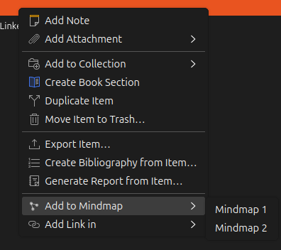

# Add items to a mindmap from the library

This is the fastest way to get items onto a mindmap: they arrive as nodes, with no links authored and no trip through the item pane. Behaviour details are in [library-menu-reference.md](library-menu-reference.md).

## Add one item

1. Select the item in the library list.
2. Right-click it and choose "Add to Mindmap".
3. Read the popup that appears in the corner: "Added 1 item to Chapter one", naming the mindmap it went to.

If the library holds more than one mindmap, "Add to Mindmap" opens a submenu rather than acting straight away. Pick the one you want from it. The entries are mindmap titles, oldest first.

Your item is now a node with no position yet. Open the mindmap tab to see where it gets placed ([mindmap-tab-howto.md](mindmap-tab-howto.md)).

## Add several items at once

1. Select them in the library list, with Ctrl-click or Shift-click.
2. Right-click the selection and choose "Add to Mindmap", then a mindmap if you are asked.
3. The popup reports how many nodes were added.

They all go in one pass. Don't be surprised if the count comes out lower than what you selected: it only counts items that weren't already on the mindmap, so a selection that's entirely there reports 0.

Attachments in the selection get skipped, as do the plugin's own "Zotero Linked Mindmaps (plugin data)" item and the mindmap notes under it. Select nothing but those and the entry still appears; clicking it reports "Added 0 items to Chapter one", naming the mindmap it targeted.

## Group several items into one

1. Select two or more items in the library list, with Ctrl-click or Shift-click.
2. Right-click the selection and choose "Group Items on Mindmap", then a mindmap if you are asked.
3. A dialog asks for the group's name. Type one, leave it blank for an unnamed group, or cancel to add and group nothing.
4. The popup reports how many items were grouped.

This is the add step and the grouping step in one action: every item that isn't already on the mindmap gets a node first, then all of them - the ones just added and the ones already there - land in a single new group. An item already on the mindmap keeps its existing node and position rather than gaining a second one.

The entry doesn't appear for a single selected item, since grouping one item says nothing a node doesn't already.

Attachments in the selection are left out of the group and reported by count in the popup, the same eligibility rule as "Add to Mindmap". A selection with nothing eligible in it groups nothing and writes nothing.

## Notes on where they land

With one mindmap in the library, or none at all, there's nothing to choose between and the entry writes without asking. An empty library gets a mindmap titled "Mindmap" created on the spot, which you can rename afterwards from the mindmap tab's sidebar ([mindmaps-manage-howto.md](mindmaps-manage-howto.md)).

If a mindmap is missing from the submenu, it's either in the trash or its storage note has stopped being readable. Restore it from Zotero's trash to get it back in the list.

The Mindmaps section is the other route onto a specific mindmap, and it's the one to use when you want to author a link at the same time ([mindmaps-panel-howto.md](mindmaps-panel-howto.md)).
