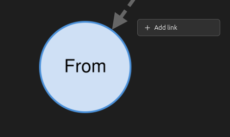

# Add a link

Four places open the add-link form, and they all produce the same link record. What differs between them is which item you start from and how the form gets presented to you. For field by field detail, see [links-add-reference.md](links-add-reference.md).

## From the Mindmaps section in the item pane

1. Select a regular item or a note in the library. The Mindmaps section is disabled for anything else: attachments, and the plugin's own "Zotero Linked Mindmaps (plugin data)" item and storage notes.
2. Open the Mindmaps section in the item pane. Click the "+" button in its header (tooltip "Add link"). The section expands if it was collapsed.
3. If the panel already names a mindmap after "Mindmap:", that's where the link goes and you won't be asked anything. You only get the "Add to mindmap:" question when the item isn't in a mindmap yet and the library holds more than one; pick one and click "Continue".
4. Pick a link type under "Type".
5. Type a label under "Name (optional)" if you want one. Leave it blank otherwise.
6. If a "Direction" dropdown appeared, choose which way the relation runs. Both options spell it out using the type as the verb, so for `cites` you are picking between "This item cites the target" and "The target cites this item".
7. Click "Choose target" and pick the item or note to link to in Zotero's item selector.
8. Click "Save". The links list redraws with the new link.

## From a node in the mindmap tab

1. Open the mindmap tab and load the mindmap you want (see [mindmap-tab-howto.md](mindmap-tab-howto.md)).
2. Right-click the node you want to link from. A small menu opens at the click point with one action, "Add link".
3. Click "Add link". The node docks in the panel beside the graph and the form opens under its summary, on the mindmap the graph is currently drawing. You won't be asked which mindmap that is, because it's the one in front of you.

   

4. Fill in the form as in steps 4 to 8 above. The link appears on the graph while you watch.

Left-clicking a node docks it without opening the form. Right-clicking empty canvas or a group region opens the grouping menu, not this one (see [grouping-howto.md](grouping-howto.md)).

## From the docked panel's own button

The panel in the mindmap tab has no section header, so it carries an in-body "Add link" button under the link list instead. Click it to open the form, click it again to hide the form. It writes to the same mindmap the panel is showing, so it asks nothing either. You won't find this button in the item-pane mount, which uses the header "+" instead.

## From the library context menu

1. Select one or more items in the library list.
2. Right-click the selection. With more than one mindmap in the library you get an "Add link" submenu: open it and click the mindmap the link belongs in. With one mindmap or none, you get a plain "Add link…" entry that uses the library's default mindmap.
3. A dialog titled "Add link" opens for the first eligible item, already pointed at the mindmap you chose in step 2. Fill it in and click "Save", or close it to skip that item.
4. The dialog for the next eligible item opens once the previous one has closed. Anything that's neither a regular item nor a note gets skipped without a dialog, as do the plugin's own data item and storage notes.

Each dialog waits for the one before it, so a multi-item run can't end up with two saves racing each other. See [library-menu-reference.md](library-menu-reference.md).

## Link to a node that lives in another mindmap

Use "Link to another mindmap…" instead of "Choose target…" at step 7. The steps are in [cross-mindmap-links-howto.md](cross-mindmap-links-howto.md).

## Change a link

Got the type, name or direction wrong on an existing link? Edit it in place rather than removing it and adding it again.

1. Find the link's row in the Mindmaps section - in the item pane, or in the docked panel beside the graph in the mindmap tab.
2. Hover the row (or tab to it) and click the pencil icon (tooltip "Edit link"), just before "Remove link".
3. The form opens with Type, Name and Direction already set to what the link currently has. The other end of the link is shown as plain text; it can't be changed here.
4. Change Type, Name and/or Direction as needed.
5. Click "Save". The row updates in place - it stays the same link, not a new one - and the graph and the panels at both ends reflect the change. Click "Cancel" instead to back out without saving.
