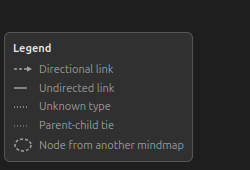

# Work with the Mindmap tab

Opening, moving around, and closing the tab. For what each control is, see the [mindmap tab reference](mindmap-tab-reference.md).

## Open the tab

Either:

1. Open the File menu.
2. Click "Mindmap".

Or press Shift+G. The shortcut is ignored while your cursor is in a text field, a search box, or a note editor, so it won't fire on you mid-sentence.

Either route reselects the existing Mindmap tab when one is already open, so you can't end up with two.

## Switch to a different mindmap

1. Expand the sidebar with `›` if it is collapsed.
2. Click the row for the mindmap you want.

The graph reloads. The row you clicked is highlighted while its mindmap is loaded.

## Hide and show the mindmap list

Click `‹` at the top of the sidebar to collapse it to a narrow bar, and `›` to bring it back. The choice is remembered across restarts.

Collapse it when the graph needs the width. Only the toggle stays visible while it's collapsed, so creating, renaming and deleting mindmaps all mean expanding it again first.

## Pan and zoom the graph

Drag empty canvas to pan. Scroll to zoom. Both come straight from Cytoscape's defaults.

A small toolbar in the top right of the graph adds three more: zoom out, zoom in, and fit-to-window, which brings the whole mindmap back into view when you have panned away from it or a node has drifted off the edge. Fitting changes only what you are looking at; it never moves a node or writes a position.

## What the lines mean

The same toolbar carries a legend toggle. The legend names every line and node style the graph can draw: a directional link, an undirected one, a link whose type is no longer in the vocabulary, the faint tie between a note and its parent item, and a node borrowed from another mindmap. Whether it is showing is remembered between sessions.

## Select several nodes

Shift-click each node in turn, or hold Shift and drag a box across empty canvas. The selection is what the grouping menu acts on. See [grouping](grouping-howto.md).

## Find a node's item in the library

1. Click the node. The dock opens on the right of the tab.
2. Click "Show in library".

Zotero switches to the Library tab and selects that item. Your Mindmap tab stays open, and the tab bar gets you back to it.

Clicking a node never jumps to the library by itself. That's deliberate: being thrown out of the graph is something you should have to ask for, so it lives behind a button.

If a node shows "(missing item)", the dock has no "Show in library" button, because the Zotero item behind that node is gone. Either remove the node from the mindmap through the [Mindmaps section](mindmaps-panel-howto.md), or restore the item from the trash.

## Close the tab

Close it like any Zotero tab, with its close button or the tab-close shortcut.

Nothing is lost by closing it. Positions, groups and links are saved as you make them, not on the way out. One thing to expect: reopening the tab loads the first mindmap in the list, not the one you were last looking at.
