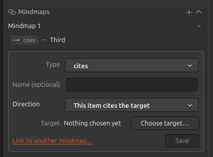

# Work with the Mindmaps section

The panel lives in the item pane under the heading "Mindmaps", and again in the docked panel beside the graph in the mindmap tab. States and controls are listed in [mindmaps-panel-reference.md](mindmaps-panel-reference.md).

## Put an item on a mindmap

An item joins a mindmap as a side effect of its first link. There's no "add me" button in the panel.

1. Select the item and open the Mindmaps section. It reads "Not in a mindmap yet. Add it to one to start linking."
2. Click the "+" in the section header.
3. Choose the mindmap under "Add to mindmap:" and click "Continue". This is the one moment you get asked, and only when the library holds more than one mindmap.
4. Fill in the add-link form and click "Save".

The item is now a node in that mindmap, and the layout will place it on the next render.

If you want to add items without authoring a link, use the library context menu instead: select them, right-click, "Add to mindmap" ([library-menu-howto.md](library-menu-howto.md)).

## Add a link

1. Click the "+" in the section header, or the "Add link" button in the body when the panel is the one in the mindmap tab.
2. Fill in Type, Name, Direction and target, then click "Save".

The link goes into whichever mindmap is named after "Mindmap:" at the top of the panel, no questions asked. You only get a choice when the item isn't in a mindmap yet and the library holds more than one.

Full field reference: [links-add-reference.md](links-add-reference.md).

## Remove a link

1. Find the link in the list.
2. Click "Remove" on that entry.

The link goes and both nodes stay on the mindmap. Be careful here: there's no confirmation and no undo, so if you remove the wrong one you'll have to author it again.

## Remove the item from a mindmap

1. Check the mindmap named after "Mindmap:" at the top of the panel. That is the one the removal applies to.
2. Click "Remove from mindmap".

The node and every link touching it come off that mindmap. Your Zotero item and any notes stay in the library, untouched. And if another mindmap was reaching into the removed node with a cross-mindmap link, that stub and its links get cleaned up too.

An item that's a node in several mindmaps only comes off the one shown, so repeat this for the others.

## Change which mindmap the panel shows

The panel has no selector for this, and what it shows depends on where it is:

- In the mindmap tab, the panel follows the graph. Load a different mindmap from the sidebar ([mindmaps-manage-howto.md](mindmaps-manage-howto.md)) and click the node again.
- In the item pane, it shows the first mindmap holding the item, ordered by storage note id, and nothing will move it off that one. Once the panel has resolved a mindmap, adding a link stops offering you a choice, so the link lands in the mindmap the panel is already showing.

That second one is a real limitation, and worth knowing about: an item in several mindmaps gives you no way to browse its links per mindmap from the item pane. Open the other mindmap in the mindmap tab and click the node there instead.
